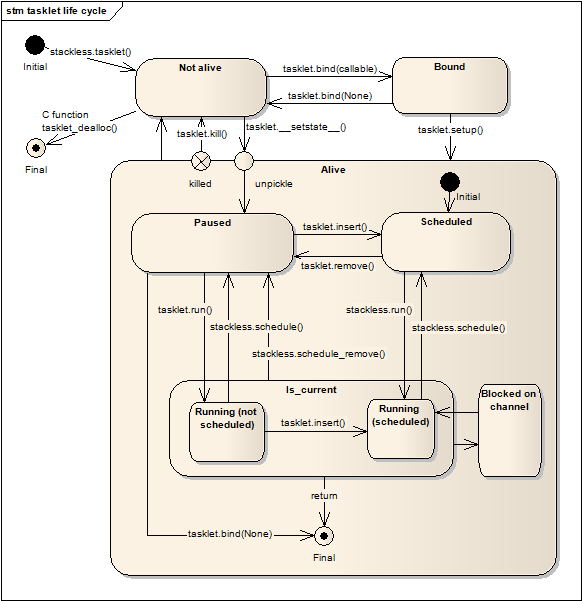

.. _tasklets:

********************************
Tasklets --- Lightweight threads
********************************

Tasklets wrap functions, allowing them to be launched as microthreads to be
run within the scheduler.

Launching a tasklet::

    stackless.tasklet(callable)(*args, **kwargs)

That is the most common way of launching a tasklet.  This does not just create
a tasklet, but it also automatically inserts the created tasklet into the
scheduler.

Example - launching a more concrete tasklet::

    >>> def func(*args, **kwargs):
    ...     print("scheduled with", args, "and", kwargs)
    ...
    >>> stackless.tasklet(func)(1, 2, 3, string="test")
    <stackless.tasklet object at 0x01C58030>
    >>> stackless.run()
    scheduled with (1, 2, 3) and {'string': 'test'}

--------------------------------
Tasklets, main, current and more
--------------------------------

There are two especially notable tasklets, the main tasklet and the current
tasklet.

The main tasklet is fixed, and it is the initial thread of execution of
your application.  Chances are that it is running the scheduler.

The current tasklet however, is the tasklet that is currently running.  It
might be the main tasklet, if no other tasklets are being run.  Otherwise,
it is the entry in the scheduler's chain of runnable tasklets, that is
currently executing.

Example - is the main tasklet the current tasklet::

    stackless.main == stackless.current
    
Example - is the current tasklet the main tasklet::

    stackless.current.is_main == 1

Example - how many tasklets are scheduled::

    stackless.runcount

.. note::

  The main tasklet factors into the :attr:`stackless.runcount` value.  If you
  are checking how many tasklets are in the scheduler from your main loop,
  you need to keep in mind that there will be another tasklet in there over
  and above the ones you explicitly created.

---------------------
The ``tasklet`` class
---------------------

.. class:: tasklet(func=None, args=None, kwargs=None)

   This class exposes the form of lightweight thread (the tasklet) provided by
   |SLP|.  Wrapping a callable object and arguments to pass into
   it when it is invoked, the callable is run within the tasklet.
   
   Tasklets are usually created in the following manner::
   
   >>> stackless.tasklet(func)(1, 2, 3, name="test")
   
   The above code is equivalent to::
   
   >>> t = stackless.tasklet()
   >>> t.bind(func)
   >>> t.setup(1, 2, 3, name="test")
   
   >>> t = stackless.tasklet()
   >>> t.bind(func, (1, 2, 3), {"name":"test"})
   >>> t.insert()

   In fact, the *tasklet.__init__* method just calls :meth:`tasklet.bind`
   and the *tasklet.__call__* method calls :meth:`tasklet.setup`.

   Note that when an implicit :meth:`tasklet.insert` is invoked, there is no need
   to hold a reference to the created tasklet.
   
.. method:: tasklet.bind(func=None, args=None, kwargs=None)

   Bind the tasklet to the given callable object, *func*::

   >>> t = stackless.tasklet()
   >>> t.bind(func)

   In most every case, programmers will instead pass *func* into the tasklet
   constructor::

   >>> t = stackless.tasklet(func)

   Note that the tasklet cannot be run until it has been provided with
   arguments to call *func*.  They can be provided as *args* and/or *kwargs*
   to this function, or through a subsequent call to
   :meth:`tasklet.setup`.  The difference is that when providing them to
   :meth:`tasklet.bind`, the tasklet is not made runnable yet.

   *func* can be None when providing arguments, in which case a previous call
   to :meth:`tasklet.bind` must have provided the function.
   
   To clear the binding of a tasklet set all arguments to ``None``. This
   is especially useful, if you run a tasklet only partially::
   
      >>> def func():
      ...     try:
      ...        ... # part 1
      ...        stackless.schedule_remove()
      ...        ... # part 2
      ...     finally:
      ...        ... # cleanup
      >>> t = stackless.tasklet(func)()
      >>> stackless.enable_softswitch(True)
      >>> stackless.run() # execute part 1 of func
      >>> t.bind(None)    # unbind func(). Don't execute the finally block  
   
   If a tasklet is alive, it can be rebound only if the tasklet is
   not the current tasklet and if the tasklet is not scheduled and 
   if the tasklet is restorable. :meth:`bind` raises :exc:`RuntimeError`,
   if these conditions are not met.

.. method:: tasklet.setup(*args, **kwargs)

   Provide the tasklet with arguments to pass into its bound callable::

   >>> t = stackless.tasklet()
   >>> t.bind(func)
   >>> t.setup(1, 2, name="test")
   
   In most every case, programmers will instead pass the arguments and
   callable into the tasklet constructor instead::

   >>> t = stackless.tasklet(func)(1, 2, name="test")
   
   Note that when tasklets have been bound to a callable object and
   provided with arguments to pass to it, they are implicitly
   scheduled and will be run in turn when the scheduler is next run.

   The above code is equivalent to::
   
   >>> t = stackless.tasklet()
   >>> t.bind(func, (1, 2), {"name":"test"})
   >>> t.insert()
   
.. method:: tasklet.insert()

   Insert a tasklet at the end of the scheduler runnables queue, given that it isn't blocked.
   Blocked tasklets need to be reactivated by channels.

.. method:: tasklet.remove()

   Remove a tasklet from the runnables queue.
   
   .. note::
   
      If this tasklet has a non-trivial C-state attached, Stackless
      will kill the tasklet when the containing thread terminates.
      Since this will happen in some unpredictable order, it may cause unwanted
      side-effects. Therefore it is recommended to either run tasklets to the
      end or to explicitly :meth:`kill` them.

.. method:: tasklet.run()

   If the tasklet is alive and not blocked on a channel, then it will be run
   immediately.  However, this behaves differently depending on whether
   the tasklet is in the scheduler's chain of runnable tasklets.
   
   Example - running a tasklet that is scheduled::
   
      >>> def f(name):
      ...     while True:
      ...         c=stackless.current
      ...         m=stackless.main
      ...         assert c.scheduled
      ...         print("%s id=%s, next.id=%s, main.id=%s, main.scheduled=%r" % (name,id(c), id(c.next), id(m), m.scheduled))
      ...         stackless.schedule()
      ...
      >>> t1 = stackless.tasklet(f)("t1")
      >>> t2 = stackless.tasklet(f)("t2")
      >>> t3 = stackless.tasklet(f)("t3")
      >>>
      >>> t1.run()
      t1 id=36355632, next.id=36355504, main.id=30571120, main.scheduled=True
      t2 id=36355504, next.id=36355888, main.id=30571120, main.scheduled=True
      t3 id=36355888, next.id=30571120, main.id=30571120, main.scheduled=True

   What you see here is that *t1* is not the only tasklet that ran.  When *t1*
   yields, the next tasklet in the chain is scheduled and so forth until the
   tasklet that actually ran *t1* - that is the main tasklet - is scheduled and
   resumes execution.
   
   If you were to run *t2* instead of *t1*, then we would have only seen the
   output of *t2* and *t3*, because the tasklet calling :attr:`run` is before
   *t1* in the chain.

   Removing the tasklet to be run from the scheduler before it is actually
   run, gives more predictable results as shown in the following example.  But
   keep in mind that the scheduler is still being run and the chain is still
   involved, the only reason it looks correct is tht the act of removing the
   tasklet effectively moves it before the tasklet that calls
   :meth:`remove`.

   Example - running a tasklet that is not scheduled::

      >>> t2.remove()
      <stackless.tasklet object at 0x022ABDB0>
      >>> t2.run()
      t2 id=36355504, next.id=36356016, main.id=36356016, main.scheduled=True
      >>> t2.scheduled
      True
      
   While the ability to run a tasklet directly is useful on occasion, that
   the scheduler is still involved and that this is merely directing its
   operation in limited ways, is something you need to be aware of.

.. method:: tasklet.switch()

   Similar to :meth:`tasklet.run` except that the calling tasklet is
   paused.  This function can be used to implement `raw` scheduling without involving
   the scheduling queue.

   The target tasklet must belong to the same thread as the caller.
   
   Example - switch to a tasklet that is scheduled. Function f is defined as 
   in the previous example::
      
      >>> t1 = stackless.tasklet(f)("t1")
      >>> t2 = stackless.tasklet(f)("t2")
      >>> t3 = stackless.tasklet(f)("t3")
      >>> t1.switch()
      t1 id=36413744, next.id=36413808, main.id=36413680, main.scheduled=False
      t2 id=36413808, next.id=36413872, main.id=36413680, main.scheduled=False
      t3 id=36413872, next.id=36413744, main.id=36413680, main.scheduled=False
      t1 id=36413744, next.id=36413808, main.id=36413680, main.scheduled=False
      t2 id=36413808, next.id=36413872, main.id=36413680, main.scheduled=False
      t3 id=36413872, next.id=36413744, main.id=36413680, main.scheduled=False
      t1 id=36413744, next.id=36413808, main.id=36413680, main.scheduled=False
      ...
      Traceback (most recent call last):
        File "<stdin>", line 1, in <module>
        File "<stdin>", line 6, in f
      KeyboardInterrupt
      >>>
      
   What you see here is that the main tasklet was removed from the scheduler. 
   Therefore the scheduler runs until it got interrupted by a keyboard interrupt.

.. method:: tasklet.raise_exception(exc_class, *args)

   Raise an exception on the given tasklet.  *exc_class* is required to be a
   sub-class of :exc:`Exception`.  It is instantiated with the given arguments
   *args* and raised within the given tasklet.
   
   In order to make best use of this function, you should be familiar with
   how tasklets and the scheduler :ref:`deal with exceptions
   <slp-exc-section>`, and the purpose of the :ref:`TaskletExit <slp-exc>`
   exception.

.. method:: tasklet.throw(exc=None, val=None, tb=None, pending=False)

   Raise an exception on the given tasklet.  The semantics are similar
   to the `raise` keywords, and so, this can be used to send an existing
   exception to the tasklet.

   if *pending* evaluates to True, then the target tasklet will be made
   runnable and the caller continues.  Otherwise, the target will be inserted
   before the current tasklet in the queue and switched to immediately.

.. method:: tasklet.kill(pending=False)

   Raises the :ref:`TaskletExit <slp-exc>` exception on the tasklet.
   *pending* has the same meaning as for :meth:`tasklet.throw`.

   This can be considered to be shorthand for::

       >>> t.throw(TaskletExit, pending=pending)

.. method:: tasklet.set_atomic(flag)

   This method is used to construct a block of code within which the tasklet
   will not be auto-scheduled when preemptive scheduling.  It is useful for 
   wrapping critical sections that should not be interrupted::

     old_value = t.set_atomic(1)
     # Implement unsafe logic here.
     t.set_atomic(old_value)

   Note that this will also prevent involuntary thread switching, i.e. the
   thread will hang on to the `GIL` for the duration.

.. method:: tasklet.bind_thread([thread_id])

   Rebind the tasklet to the current thread, or a |PY| thread with
   the given *thread_id*.

   This is only safe to do with just-created tasklets, or soft-switchable
   tasklets.  This is the case when a tasklet has just been unpickled.  Then
   it can be useful in order to hand it off to a different thread for execution.

   The relationship between tasklets and threads is :doc:`covered elsewhere
   <threads>`.

.. method:: tasklet.set_ignore_nesting(flag)

   It is probably best not to use this until you understand nesting levels::

     old_value = t.set_ignore_nesting(1)
     # Implement unsafe logic here.
     t.set_ignore_nesting(old_value)

The following (read-only) attributes allow tasklet state to be checked:

.. attribute:: tasklet.alive

   This attribute is ``True`` while a tasklet is still running.  Tasklets that
   are not running will most likely have either run to completion and exited,
   or will have unexpectedly exited through an exception of some kind.

.. attribute:: tasklet.paused

   This attribute is ``True`` when a tasklet is alive, but not scheduled or
   blocked on a channel. This state is entered after a :meth:`tasklet.bind` with 
   2 or 3 arguments, a :meth:`tasklet.remove` or by the main tasklet, when it 
   is acting as a watchdog.

.. attribute:: tasklet.blocked

   This attribute is ``True`` when a tasklet is blocked on a channel.

.. attribute:: tasklet.scheduled

   This attribute is ``True`` when the tasklet is either in the runnables list
   or blocked on a channel.

.. attribute:: tasklet.restorable

   This attribute is ``True``, if the tasklet can be completely restored by 
   pickling/unpickling. If a tasklet is restorable, it is possible to continue 
   running the unpickled tasklet from whatever point in execution it may be.
   
   All tasklets can be pickled for debugging/inspection 
   purposes, but an unpickled tasklet might have lost runtime information (C stack).
   For the tasklet to be runnable, it must not have lost runtime information
   (C stack usage for instance).

The following attributes allow checking of user set situations:

.. attribute:: tasklet.atomic

   This attribute is ``True`` while this tasklet is within a
   :meth:`tasklet.set_atomic` block

.. attribute:: tasklet.block_trap

   Setting this attribute to ``True`` prevents the tasklet from being blocked
   on a channel.

.. attribute:: tasklet.ignore_nesting

   This attribute is ``True`` while this tasklet is within a
   :meth:`tasklet.set_ignore_nesting` block

The following attributes allow identification of tasklet place:

.. attribute:: tasklet.is_current

   This attribute is ``True`` if the tasklet is the current tasklet
   of the thread it belongs to. To see if a tasklet is the currently executing
   tasklet in the current thread use the following |PY| code::

      import stackless
      def is_current(tasklet):
          return tasklet is stackless.current

.. attribute:: tasklet.is_main

   This attribute is ``True`` if the tasklet is the main tasklet of the thread it
   belongs to. To check if a tasklet is the main tasklet of the current thread
   use the following |PY| code::

      import stackless
      def is_current_main(tasklet):
          return tasklet is stackless.main
   
.. attribute:: tasklet.thread_id

   This attribute is the id of the thread the tasklet belongs to.  If its
   thread has terminated, the attribute value is ``-1``.
   
   The relationship between tasklets and threads is :doc:`covered elsewhere
   <threads>`.

In almost every case, tasklets will be linked into a chain of tasklets.  This
might be the scheduler itself, otherwise it will be a channel the tasklet is
blocked on.

The following attributes allow a tasklets place in a chain to be identified:

.. attribute:: tasklet.prev

   The previous tasklet in the chain that this tasklet is linked into.

.. attribute:: tasklet.next

   The next tasklet in the chain that this tasklet is linked into.

The following attributes are intended only for implementing debuggers, 
profilers, coverage tools and the like. Their behavior is part of the 
implementation platform, rather than part of the language definition, 
and thus may not be available in all |SLP| implementations.

.. attribute:: tasklet.trace_function

.. attribute:: tasklet.profile_function

   The trace / profile function of the tasklet. These attributes 
   are the tasklet counterparts of the functions :func:`sys.settrace`,
   :func:`sys.gettrace`, :func:`sys.setprofile` and :func:`sys.getprofile`.

^^^^^^^^^^^^^^^^^^
Tasklet Life Cycle
^^^^^^^^^^^^^^^^^^

Here is a somewhat simplified state chart that shows the life cycle of a 
tasklet instance. The chart does not show the nesting-level, the thread-id 
and the flags atomic, ignore-nesting, block-trap and restorable. 

Furthermore the diagram does not show the scheduler functions 
:func:`stackless.run`, :func:`stackless.schedule` and 
:func:`stackless.schedule_remove()`. For the purpose of understanding the 
state transitions these functions are roughly equivalent to the following 
|PY| definitions::

   def run():
       main = stackless.current
       def watchdog():
           while stackless.runcount > 1:
               stackless.current.next.run()
           main.switch()
       stackless.tasklet(watchdog)().switch()
      
   def schedule():
       stackless.current.next.run()
   
   def schedule_remove():
       stackless.current.next.switch()
